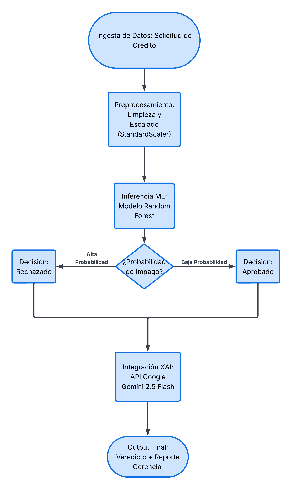

# Sistema de Evaluación de Riesgo Crediticio

## 1. Definición del Problema y Contexto

En el sector financiero, la evaluación de solicitudes de crédito requiere un equilibrio estricto entre precisión analítica y velocidad de respuesta. Los métodos tradicionales basados únicamente en reglas manuales son susceptibles a cuellos de botella operativos y sesgos cognitivos. 

Este proyecto propone e implementa un sistema automatizado de soporte a la toma de decisiones que utiliza un modelo predictivo de Machine Learning (`RandomForestClassifier`) para evaluar instantáneamente la probabilidad de impago de un cliente. Adicionalmente, el sistema integra capacidades de Inteligencia Artificial Generativa (`Google Gemini API`) como capa de explicabilidad (Explainable AI - XAI), traduciendo el output probabilístico en un reporte gerencial estructurado para la validación final del Comité de Créditos.

## 2. Diccionario de Datos

**Descripción del Dataset:**

El conjunto de datos utilizado (`credit_risk_dataset.csv`) es un dataset tabular diseñado para la clasificación binaria de riesgo financiero. Contiene información histórica de 5,000 solicitantes, incluyendo variables demográficas (edad, género, ciudad), situación laboral (experiencia, tipo de empleo) y métricas financieras clave (ingresos, monto del préstamo, historial de score crediticio). El objetivo principal es predecir la viabilidad de otorgar un crédito mitigando el riesgo de impago.

| Variable | Tipo de Dato | Descripción |
| :--- | :--- | :--- |
| `Age` | Continuo | Edad del solicitante en años. |
| `Income` | Continuo | Ingresos netos anuales del solicitante expresados en USD. |
| `LoanAmount` | Continuo | Monto total del préstamo solicitado en USD. |
| `CreditScore` | Continuo | Puntuación crediticia histórica del cliente (escala estándar, valores < 600 representan alto riesgo). |
| `YearsExperience` | Continuo | Años de experiencia laboral comprobable del solicitante. |
| `Gender` | Binario (0/1) | Variable categórica codificada (One-Hot) sobre el género. |
| `Education` | Binario (0/1) | Variable categórica codificada (One-Hot) sobre el nivel educativo máximo alcanzado. |
| `City` | Binario (0/1) | Variable categórica codificada (One-Hot) sobre la ciudad de residencia. |
| `EmploymentType` | Binario (0/1) | Variable categórica codificada (One-Hot) sobre la situación laboral actual. |
| `LoanApproved` | Binario (0/1) | **Variable Objetivo (Target)**: Representa la aprobación (`1`) o el rechazo (`0`) del crédito. |

## 3. Diagrama de Flujo del Sistema
El siguiente esquema ilustra la arquitectura de la solución, desde la ingesta de datos hasta la emisión del reporte generado por la IA.



## 4. Tarjeta del Modelo (Model Card)

Para un análisis técnico exhaustivo sobre la arquitectura del modelo, los datos de entrenamiento, consideraciones éticas y limitaciones, por favor consulta el documento adjunto:

**[Ver Model Card Detallado](model-card.md)**

## 5. Resultados y Métricas

El modelo fue evaluado utilizando un conjunto de datos de prueba (test set) que representa el 20% de los datos originales, obteniendo los siguientes resultados estáticos (offline):

* **Accuracy (Exactitud):** 96.40%
* **Precision (Precisión):** 95.33%
* **Recall (Sensibilidad):** 88.70%
* **F1-Score:** 91.89%
* **Validación Cruzada (K-Fold=5):** F1-Score promedio de 93.31%, lo que demuestra que el modelo es estable y no sufre de sobreajuste.

*Nota sobre el alcance:* Para la versión 1.0.0 de este proyecto, la evaluación se limita estrictamente a métricas estáticas (offline). La implementación de telemetría y métricas dinámicas (online) en un entorno de producción real queda fuera del alcance de esta entrega y se considerará para futuras iteraciones.

## 6. Estrategia de Git Utilizada

Para el desarrollo de este proyecto se implementó un flujo de trabajo estructurado para el control de versiones:
* Se mantuvo una rama `main` protegida que contiene únicamente el código estable y funcional.
* El desarrollo iterativo (creación de notebooks, scripts de Python y redacción de documentación) se realizó en una rama paralela llamada `development`.
* La integración de los cambios finales se ejecutó mediante un **Pull Request (PR)** hacia la rama `main`. Finalmente, se generó un *Release v1.0.0* para empaquetar la versión final del sistema.

## 7. Estructura del Repositorio y Ejecución

El proyecto sigue los principios SOLID y de Programación Orientada a Objetos. 

### Organización
* `data/`: Contiene los conjuntos de datos crudos y limpios (`.csv`).
* `notebooks/`: Entornos de experimentación y Análisis Exploratorio de Datos.
* `artifacts/`: Archivos binarios serializados (`.pkl`) del modelo entrenado y el escalador.
* `src/`: Scripts de código fuente para uso en producción.

### Ejecución
Asegúrese de tener el entorno virtual activo e instale las dependencias desde `requirements.txt`. El flujo de ejecución es el siguiente:

```bash
# 1. Ejecutar pipeline de limpieza de datos
python src/preprocesamiento.py

# 2. Entrenar el modelo y generar los artefactos (.pkl)
python src/entrenamiento.py

# 3. Simular la inferencia en producción (Evaluación + LLM)
python src/prediccion.py
```

## 8. Conclusiones

* **Eficacia del Enfoque Híbrido (ML + GenAI):** La combinación de un modelo clásico de Machine Learning (`RandomForestClassifier`) con un modelo de lenguaje fundacional (`Gemini 2.5 Flash`) demostró ser una arquitectura altamente viable para el sector financiero. Se logra solucionar el problema de la "caja negra" de los modelos complejos, traduciendo una certeza probabilística en un argumento de negocio legible y accionable (Explainable AI) en milisegundos.

* **Robustez y Estabilidad de la Predicción:** El modelo predictivo alcanzó un desempeño óptimo en la fase offline con un F1-Score de 91.89% y un F1-Score medio de 93.31% bajo validación cruzada (K-Fold=5). Estos resultados confirman que el algoritmo es estructuralmente estable, mitiga el desbalance de clases mediante el ajuste de pesos (`class_weight='balanced'`) y no presenta síntomas de sobreajuste (*overfitting*).

* **Determinación Contextual Coherente:** Mediante las pruebas cualitativas programadas en `prediccion.py`, se verificó que la API de Google Gemini respeta estrictamente las variables de entrada proporcionadas por el pipeline de datos (como el *CreditScore* y la relación ingreso/préstamo). El LLM contextualiza los factores financieros con coherencia corporativa y cero tolerancia a la alucinación de datos.

* **Delimitación del Alcance Operativo:** Para la versión 1.0.0, el proyecto cumple exitosamente con el objetivo de automatizar de punta a punta el pipeline de datos, el entrenamiento parametrizado y la inferencia simulada mediante scripts estructurados en Programación Orientada a Objetos (POO). Al quedar fuera de alcance el despliegue en la nube, se establece una base técnica sólida para una futura migración hacia servicios gestionados y arquitectura de microservicios (Docker/Cloud).
